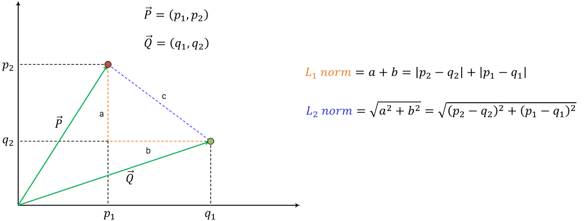
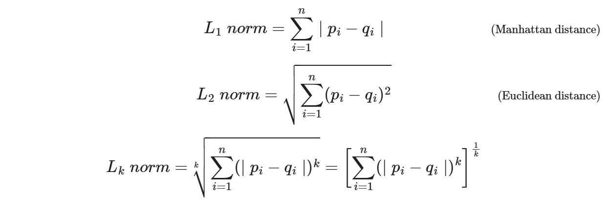

# KNN Classification for Student Performance

## 1. Introduction
This project applies the K-Nearest Neighbors (KNN) algorithm to classify student performance based on various subject scores. The objective is to predict the performance category of students using their scores in subjects such as Hindi, English, Science, Maths, History, Geography, and the total score.
## 2. Idea of KNN algorithm
The KNN algorithm is a simple, yet powerful machine learning technique for classification and regression tasks, which classifies a data point based on the majority label of its nearest neighbors in the feature space.

## 3. The steps to implement KNN
1. Caculate the distance from new data poinnt(data needed classficated) to the data points in X_train
2. Sort these distances in ascending order(from small to large)
3. Get K nearest data point(s)
4. Count the number of times the corresponding labels appear that first gap. Choose the label that appears more often (uniform). With major voting in KNN we can calculate the weights of the points which are nearest then chose point
which has the largest weight.
### 3.1. How to calculate the distancedistance

##### Formula:

#### Coding
```
def caclL1():
	l1_distance = 0
	for i in range(len(x_star)):
		l1_distance += np.abs(x_star[i]-x_0[i])
	return l1_distance


def caclL2():
	l2_distance = 0
	for i in range(len(x_star)):
		l2_distance += (x_star[i]-x_0[i]) ** 2
	l2_distance = np.sqrt(l2_distance)
	return l2_distance

l1_distance_vec = np.sum(np.abs(x_star - x_0))
l2_distance_vec = np.sqrt(np.sum((x_star - x_0) ** 2))
```

## Overview of the Repository
The repo contain 2 parts: 
* knn_base.py to implement KNN algorithm and handle data
* app.py to run program on website(localhost) by streamlit
* data source: [Student Exam Results dataset](https://www.kaggle.com/datasets/jayantiprasad/student-exam-results-dataset) 


## How to install
```
git clone https://github.com/letiendat24/classify_student
```

